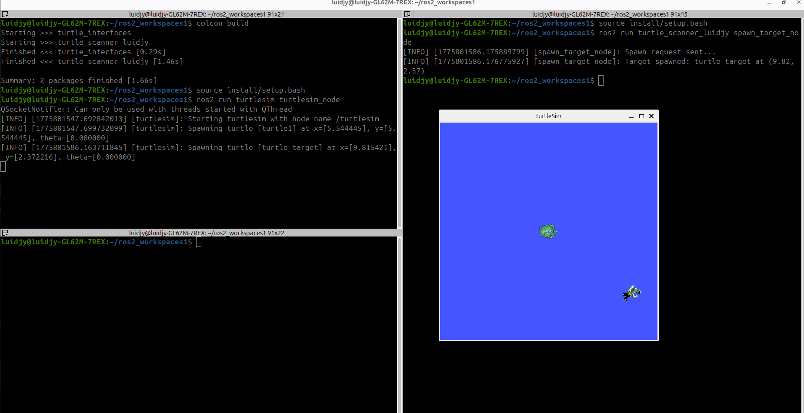

# turtle_scanner_luidjy

## Partie 1 - Spawn d'une cible aleatoire

Dans cette partie, on a cree le noeud `spawn_target.py`.
Ce noeud utilise le service `/spawn` de turtlesim pour faire apparaitre une tortue appelee `turtle_target` a une position aleatoire.

### Resultat dans TurtleSim



## Partie 3 - Balayage en serpentin

Dans cette partie, le noeud `turtle_scanner_node.py` genere une liste de waypoints pour faire avancer `turtle1` selon un trajet en serpentin.

Le deplacement repose sur une regulation proportionnelle :

- `Kp_ang` : corrige l'orientation de la tortue
- `Kp_lin` : corrige l'avance vers le waypoint

La tortue calcule :
- l'angle desire vers le waypoint courant
- la distance jusqu'au waypoint courant

Ensuite, elle publie une commande sur `/turtle1/cmd_vel` pour se diriger vers ce waypoint.

### Valeurs testees

| Kp_ang | Kp_lin | Observation |
|--------|--------|-------------|
| 5.0 | 0.8 | Lent, petit temps d'attente au virage, quelques zigzags, mais s'arrete |
| 20.0 | 5.0 | Trop rapide, rotation excessive, boucle, ne s'arrete plus |
| 1.0 | 20.0 | Fait des cercles, ne s'arrete plus |
| 5.0 | 1.0 | Comportement le plus stable, bon resultat |

## Partie 4 - Detection de la tortue cible

Dans cette partie, on a ajoute une logique de detection pendant le balayage.

Le noeud calcule la distance entre :
- `turtle1`
- `turtle_target`

Si cette distance devient inferieure a `detection_radius = 1.5`, alors :
- la tortue s'arrete
- le topic `/target_detected` publie `True`
- un message s'affiche dans le terminal avec les coordonnees de la cible

Le test a ete fait avec :

```bash
ros2 topic echo /target_detected
